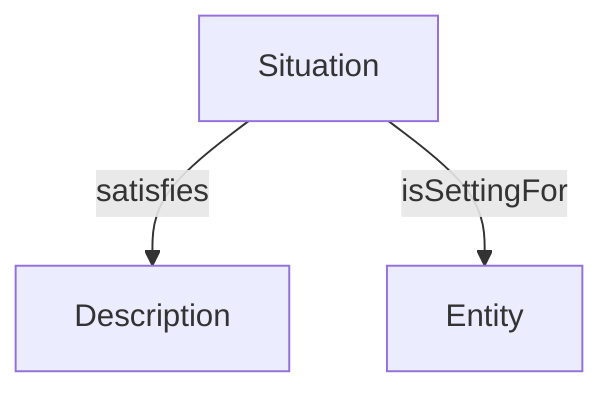
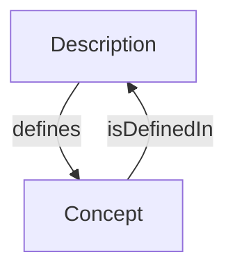
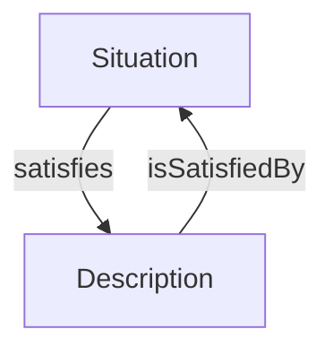
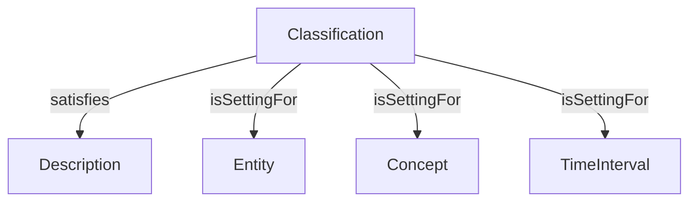
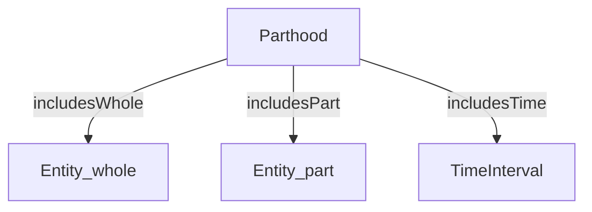
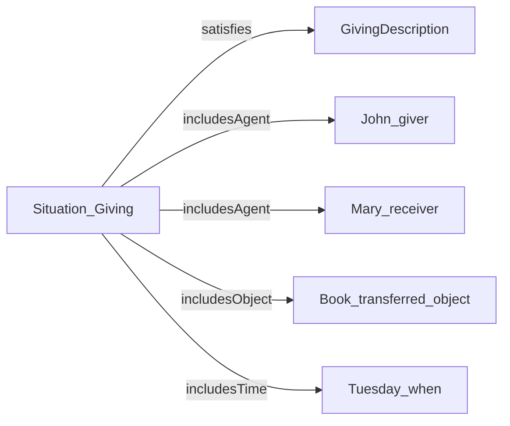

# Context Modeling Framework

## What is Context in DUL?

DUL provides rich machinery for **context-sensitive modeling**—representing how facts and relations depend on:
- **Temporal context**: When does this relation hold?
- **Conceptual context**: Under what theory/frame is this interpreted?
- **Social context**: Within what institution/agreement is this valid?

The primary mechanism is the **Situation** class and related patterns.

## The Situation Pattern

### Core Structure:


**A Situation:**
- Includes multiple entities (via `isSettingFor` and subproperties)
- Satisfies a Description (the conceptual frame)
- Has a coherent identity as a contextualized view

### Example: Coffee Preparation

**Situation**: "My coffee preparation this morning"
- **satisfies**: Recipe Description (defines roles, tasks, ingredients)
- **includesAgent**: Me (as baker role)
- **includesAction**: Grinding action, brewing action
- **includesObject**: Coffee beans, water, coffee maker
- **includesTime**: This morning (8:00-8:15 AM)

The Situation **unifies** these entities into a coherent context, interpreted through the Recipe frame.

## Descriptions: Conceptual Contexts

**Description** is the most important SocialObject subclass—it represents **conceptualizations**.

### Types of Descriptions:

**Plan**
- Describes actions to be executed
- Defines roles (who), tasks (what), parameters (how)
- Example: Project plan, recipe, travel itinerary
- **Specializations**: Project, Workflow

**Design**
- Describes structure and function
- Provides rationale for entity construction
- Example: Architectural design, software design, mechanism design

**Diagnosis**
- Describes system state for control or explanation
- Example: Medical diagnosis, fault diagnosis, situation assessment

**Norm**
- Describes social rules and obligations
- Example: Traffic law, ethical code, institutional policy

**Contract**
- Describes agreements between parties
- Defines roles (parties) and tasks (obligations)
- Example: Employment contract, treaty, license

**Goal**
- Describes desired situation
- Typically associated with Plan for achievement
- Example: Business objective, personal aspiration

**Theory**
- Describes general conceptual framework
- Example: Scientific theory, philosophical system

**Narrative**
- Describes event sequences and their interpretation
- Example: Historical account, story, case study

### The defines Relation

Descriptions **define** Concepts:



Example:
- Recipe (Description) defines "Ingredient" (Role), "Mixing" (Task)
- Traffic Law (Norm) defines "Driver" (Role), "Vehicle" (Concept)

### The satisfies Relation

Situations **satisfy** Descriptions:



Example:
- My coffee preparation (Situation) satisfies the recipe (Plan)
- Today's traffic (Situation) satisfies (or violates) traffic law (Norm)

## Classification: Concept-Based Contexts

**Classification** is a special Situation subclass for **time-indexed classification**:



### Why Classification as Situation?

Direct relation `Concept classifies Entity` is atemporal and acontextual. But:
- Classifications change over time: "John is a student (in 2020), then a teacher (in 2024)"
- Classifications depend on context: "This object is furniture (in museum), but art (in gallery)"

**Solution**: Reify classification as a Situation:
- **Simple**: `Concept 'Student' classifies Entity 'John'` (timeless)
- **Contextual**: Classification Situation satisfying University Description, including John, 'Student' concept, and TimeInterval '2020-2024'

## Parthood: Mereological Contexts

DUL provides time-indexed parthood through the **Parthood** Situation:


### Why Time-Indexed Parthood?

Parts change:
- "My bike has a luggage rack (since March 29, 2021)"
- "This ship had a mast (until the storm destroyed it)"

Direct `hasPart` relation is timeless. Parthood Situation adds temporal context.

### Multiple Parthood Relations

DUL distinguishes several mereological relations:

**hasPart / isPartOf**
- Reflexive + transitive (classical mereology)
- "The body has a brain as part"
- "2024 is part of the 21st century"

**hasProperPart / isProperPartOf**
- Transitive + asymmetric (irreflexive)
- Strict parthood (part ≠ whole)

**hasComponent / isComponentOf**
- Asymmetric (not transitive)
- For designed systems with structural roles
- "The car has an engine as component"

**hasConstituent / isConstituentOf**
- Cross-layer parthood
- Links entities from different ontological strata
- "The person has molecules as constituents"
- "The social system has persons as constituents"

## N-ary Relation Reification

Standard ontologies struggle with n-ary relations (more than 2 participants):
- **Traditional**: "John gave Mary a book on Tuesday" — how to model?

**DUL Solution**: Use Situation as a reified relation:





All binary relations project from the Situation via `isSettingFor` (and subproperties like `includesAgent`).

**Advantages:**
- Arbitrary arity (any number of participants)
- Add context freely (time, place, conditions)
- Attach qualifications (degree, modality, evidentiality)

## Practical Context Modeling Examples

### Example 1: Role-Based Context

**Scenario**: "John is a professor at MIT in 2024"

**Model**:
```
Classification₁ (Situation)
  --satisfies--> AcademicStructure (Description defining 'Professor' Role)
  --isSettingFor--> John (Person)
  --isSettingFor--> 'Professor' (Role)
  --isSettingFor--> MIT (Organization)
  --isSettingFor--> TimeInterval₂₀₂₄
```

This captures:
- What role (Professor)
- Who plays it (John)
- In what institution (MIT)
- When (2024)

### Example 2: Evolving Design Context

**Scenario**: "An old cradle is refunctionalized as a flower pot"

**Model**:
```
OriginalSituation (satisfying Baby Furniture Design)
  --isSettingFor--> Cradle₁
  --includesTime--> HistoricalPeriod
  --satisfies--> BabyFurnitureDesign (Description)
    --defines--> 'Cradle' (Role)

RefunctionalizedSituation (satisfying Garden Decoration Design)
  --isSettingFor--> Cradle₁ (same object!)
  --includesTime--> CurrentPeriod
  --satisfies--> GardenDecorationDesign (Description)
    --defines--> 'FlowerPot' (Role)
```

The same physical object (Cradle₁) participates in different Situations satisfying different Designs.

### Example 3: Multi-Perspective Event Analysis

**Scenario**: "An avalanche that may have been triggered intentionally"

**Model**:
```
Event: Avalanche₁

PhysicalSituation
  --isSettingFor--> Avalanche₁
  --satisfies--> PhysicsDescription (natural forces theory)

LegalSituation
  --isSettingFor--> Avalanche₁
  --isSettingFor--> SuspectPerson
  --satisfies--> CriminalLawDescription (intentional causation theory)
```

Same event, two interpretations, both valid in their respective descriptive contexts.

## Situation vs. Context (Conceptual Clarification)

**Situation** (DUL) ≈ **Context** (informal usage), but more precise:

- **Context** (informal): Vague notion of "relevant circumstances"
- **Situation** (DUL): Formal reification with:
    - Identity (a first-order entity)
    - Structure (`isSettingFor` relations to included entities)
    - Interpretation (satisfies a Description providing meaning)

DUL's Situations enable **context-aware reasoning**:
- What entities are co-present in a context? (Follow `isSettingFor`)
- What concepts apply in this context? (Check Description that is satisfied)
- What are the temporal bounds of this context? (Check `includesTime`)


## Modeling Workflow

1. **Identify Core Entities**
    - What are the main objects, agents, events in your domain?
    - Classify as PhysicalObject, SocialObject, Event, etc.

2. **Identify Conceptual Frames**
    - What theories, standards, or schemas organize your domain?
    - Model as Descriptions (Plan, Norm, Design, Theory, etc.)

3. **Define Concepts**
    - What roles, tasks, categories are defined by those frames?
    - Model as Concepts (Role, Task, EventType, Parameter)
    - Link via `defines` to Descriptions

4. **Model Contexts**
    - What situations or contexts instantiate those frames?
    - Model as Situations (PlanExecution, Classification, etc.)
    - Link via `satisfies` to Descriptions
    - Include entities via `isSettingFor` and specializations

5. **Add Participation**
    - How do objects participate in events?
    - Use `hasParticipant` and specializations

6. **Add Mereology**
    - What part-whole relations exist?
    - Choose appropriate parthood property (hasPart, hasComponent, hasConstituent)

7. **Add Temporal/Spatial Info**
    - When/where do events occur?
    - Use `hasTimeInterval`, `hasLocation`, `hasRegion` (for SpaceRegion)

8. **Add Information Layer** (if applicable)
    - What information objects express domain concepts?
    - Model InformationObjects and their realizations
    - Use `expresses`, `realizes`

9. **Refine with Parameters and Qualities** (if needed)
    - Add Quality-Region pattern for fine-grained attributes
    - Add Parameters to Concepts for constraints

10. **Validate Against Patterns**
    - Check that Descriptions define Concepts
    - Check that Situations satisfy Descriptions
    - Check that Classifications include Concepts, Entities, and Times
    - Check that Properties have appropriate domains/ranges
