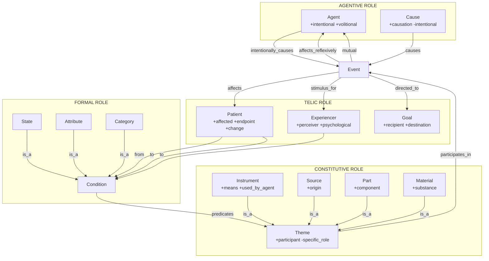
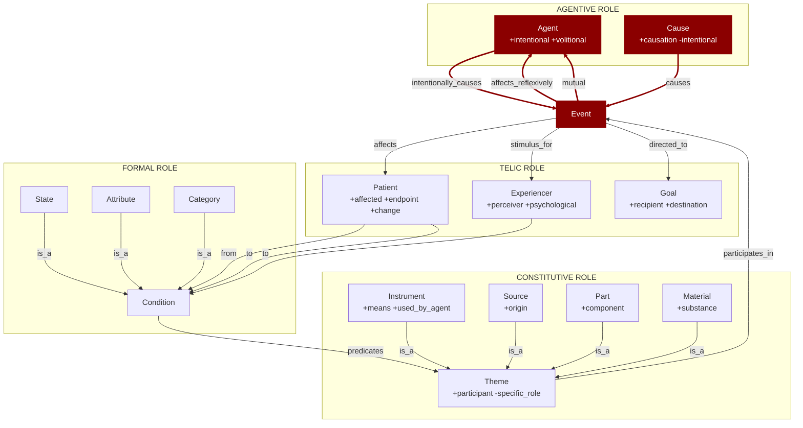
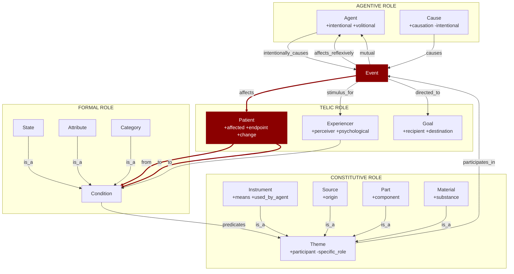
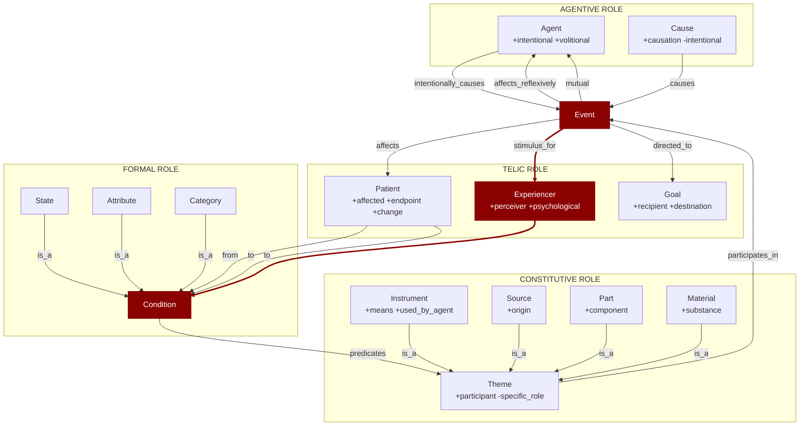
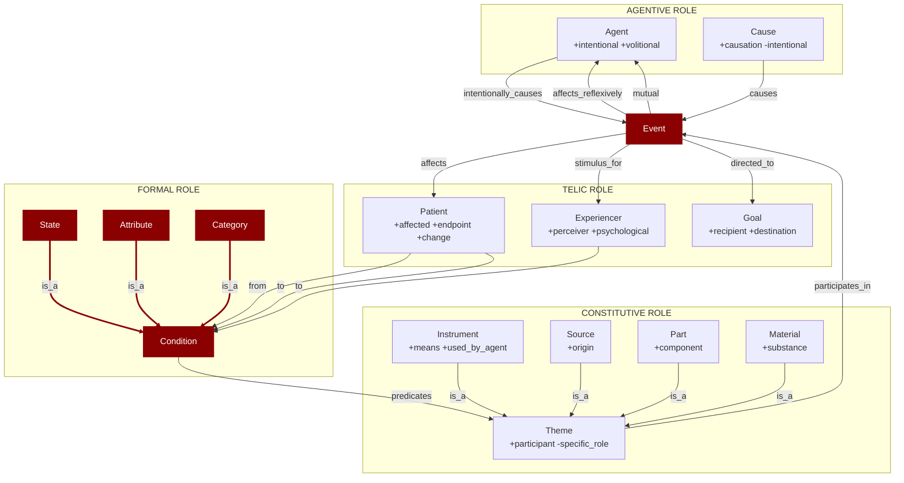
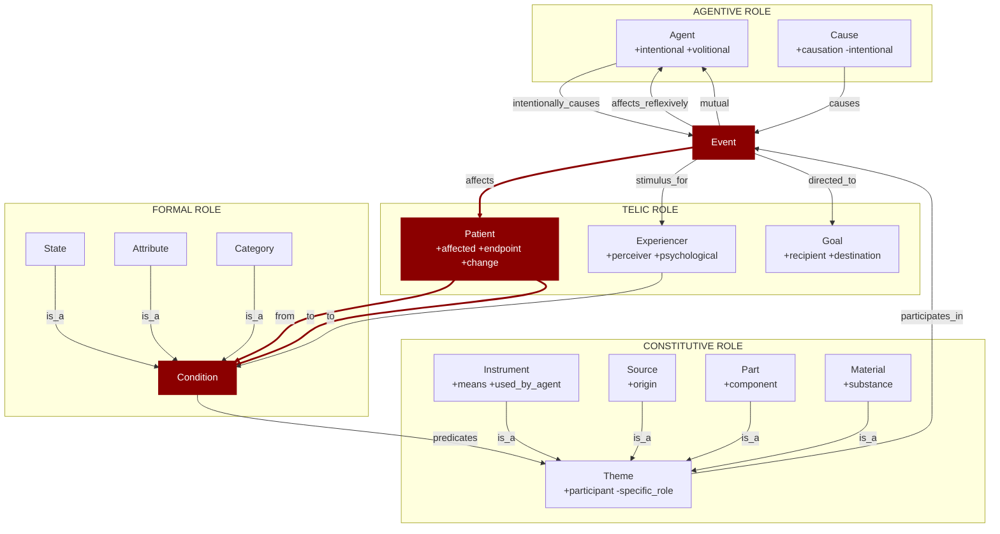
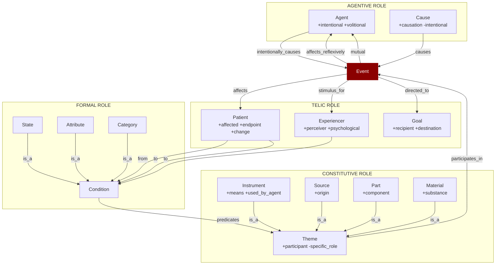

# Events

There is no consensus on the definition of *event* in the literature. Here, *event* represents something that "occurs" over time, generally causing a change of state in some concept associated with the event. In general, events can be situated on the "timeline" and have a limited duration.
Linguistically, an event can be represented by verbs and verbal derivations. 

## Event Structure

There are many proposals for "event structure", each one based on a specific approach or theory (see "Notes on DUL", below). 
Here, the sketch for event structure has a practical goal to classify eventive frames in *namespaces*. The idea for *namespaces* is just to group frames having similar characteristics
to devise the kind of Frame Elements and LUs could be associated to the frame.

Also, as in FrameNet the FEs are specific for each frame, there are a large number of FEs, although some of them (specially peripheral elements) share some semantics. Grouping FEs is harder
than grouping frames, and the idea used here is to use *qualia roles* (roughly based on *qualia structure* from Generative Lexicon). So, the use of qualia is just a criteria for create groups.
Of course, a FE specific for a frame could not fit perfectly in just one kind of qualia role.

Fig. 1 - A generic sketch of event structure

Although the concepts represented in Figure 1 recall "generic thematic roles", FrameNet name the roles based on the frame context. 
The following definitions (and observations) should be considered only as a general overview of the concept.

### Formal Role

#### State
Static conditions that hold over time without internal change.
Examples: "The door is open", "John is tall"

#### Attribute
Conditions defining properties or qualitative aspects of entities or situations.
Examples: "redness", "weight", "temperature"

#### Category
Conditions classifying entities or situations according to some criteria.
Examples: "John is a doctor", "This is a mammal"

### Agentive role

#### Agent
Some events can be characterized as the action of a sentient (volitional) entity, acting intentionally to cause a result.

Special cases:
- Affects_reflexively: Agent = Patient ("John washed himself")
- Mutual: Multiple Agents act reciprocally ("John and Mary met")

#### Cause
Characterizes the condition that causes an event (generally another event), without intentionality.

### Constitutive role

#### Theme
This is the most generic concept in the structure, and it characterizes a "participant" in the event. 
In general, this participant is passive, with no specified change or affectedness.
Theme in FrameNet is notoriously polysemous. It can be:
- Object of perception: "I saw the tree" (telic—endpoint of perception)
- Transferred entity: "Give the book to Mary" (constitutive—thing moving)
- Topic: "Talk about politics" (formal—content)
- Undergoer: "The door opened" (telic—affected entity)

Here, Theme is classified as constitutive (generic participant), but note that specific frames may use "Theme" for what are functionally telic or formal roles.

#### Instrument
Instruments are entities used by agents in a given action.

#### Source
Generic role including source, origin, start.

#### Part
Generic role including part, component, member, piece.

#### Material
Generic role including materials, objects, substances.

### Telic role

#### Patient
In events where there is some action, it characterizes the entity that is affected by the event, and there may or may not be a change in any of its states.

Patient doesn't fit cleanly into qualia structure because it combines:

- Telic aspect: endpoint/affected entity (similar to Goal)
- Constitutive aspect: participant in event
- Formal aspect: entity that changes state

#### Experiencer
Associated with events where there isn't strictly an action, but a stimuli whose effects can be perceived by an entity. 
Typically, an experiencer is associated with psychological events (emotion, perception, cognition).

As Patient, Experiencer also spans multiple qualia:

- Telic aspect: endpoint/perceiver of stimulus ("John heard the sound")
- Agentive aspect: in some frames, experiencer has control ("John listened to music")
- Formal aspect: bearer of mental state ("John knows French")

Experiencer is classified as telic (endpoint of psychological event), but note that some experiencer frames have agentive properties (perception verbs with control).

#### Goal
Generic role including endpoint concepts: goal, destination, recipient, beneficiary, purpose, intended result.
Examples: "give the book **to Mary**", "go **to Paris**", "work **for the company**"

## Namespace Classification Using Qualia

Frames are classified into namespaces based on their core FE qualia signatures.

### Causative

Causative frames foreground the **AGENTIVE ROLE**, emphasizing the causal force behind events. These frames center on entities (Agent) or events (Cause) that bring about or initiate events, 
whether through intentional action or non-intentional causation.

[Full discussion](/docs/namespaces/causative.md)

**Core Elements (highlighted in red):**
- **Event**: The occurrence being caused
- **Agent**: Intentional, volitional causer
- **Cause**: Non-intentional causal force

### Inchoative

Inchoative frames emphasize the **beginning or initiation** of a state change, foregrounding the **TELIC ROLE** through the Patient. 
These frames focus on entities that undergo change, typically expressing "coming into a state" or "beginning to be."

[Full discussion](/docs/namespaces/inchoative.md)

**Core Elements (highlighted in red):**
- **Event**: The initiating occurrence
- **Patient**: The entity undergoing change

### Experience

Experience frames emphasize **psychological or perceptual events**, foregrounding the **TELIC ROLE** through the Experiencer and the **FORMAL ROLE** through resulting Conditions. These frames focus on perception, emotion, and cognition, where an entity perceives or experiences a stimulus.

[Full discussion](/docs/namespaces/experience.md)

**Core Elements (highlighted in red):**
- **Event**: The perceptual or psychological occurrence
- **Experiencer**: The perceiving or experiencing entity
- **Condition**: The resulting mental or perceptual state

### Stative

Stative frames emphasize **static situations without internal change**, foregrounding the **FORMAL ROLE**. These frames describe states, properties, attributes, and categorical classifications that hold over time without expressing dynamic change.

[Full discussion](/docs/namespaces/stative.md)

**Core Elements (highlighted in red):**
- **Event**: The static situation (often better conceptualized as a state)
- **Condition**: General condition/state
- **State**: Specific static condition
- **Attribute**: Property or quality
- **Category**: Classification type

### Transition

Transition frames emphasize **change from one state to another**, combining **TELIC ROLE** (Patient as affected entity) with **FORMAL ROLE** (Conditions as source and target states). These frames explicitly express state transitions with clear before/after conditions.

[Full discussion](/docs/namespaces/transition.md)

**Core Elements (highlighted in red):**
- **Event**: The transitional occurrence
- **Patient**: The entity undergoing state change
- **Condition**: Source and target states (from/to)

### Eventive

Eventive frames emphasize **dynamic occurrences** as central, foregrounding the **Event itself** rather than specific participant roles. 
These frames focus on the happening or process as the primary semantic component, with participants playing supporting but less differentiated roles (typically Theme-like).

Eventive frames that do not have an explicitly defined agent, cause, or experiencer. This includes, for example, events without agentive focus, 
events with non-human agents, natural phenomena (rain, erosion, combustion, growth), several different types of processes (physical, social, etc).

[Full discussion](/docs/namespaces/eventive.md)

**Core Elements (highlighted in red):**
- **Event**: The central dynamic occurrence

### Qualia Roles and Namespace Mapping

| Qualia Role | Core Participants | Typical Namespaces | Example Frames |
|-------------|-------------------|-------------------|----------------|
| AGENTIVE | Agent, Cause | @causative | Killing, Creating, Breaking |
| TELIC | Patient, Experiencer, Goal | @inchoative, @experience, @transition | Opening, Seeing, Becoming |
| CONSTITUTIVE | Theme, Instrument, Source | @eventive | Motion, Communication |
| FORMAL | State, Attribute, Category | @stative, @attribute | Being_located, Having_property |

## Notes from DUL

More theoretically, events can be classified in different ways, possibly based on *aspect* (e.g. stative, continuous, accomplishement, achievement, etc.), 
on *agentivity* (e.g. intentional, natural, etc.), or on *typical participants* (e.g. human, physical, abstract, food, etc.). 
Here no special direction is taken, and the following explains why. 

Events are related to observable situations, and they can have different views at a same time. 
If a position has to be suggested here anyway, the participant-based classification of events seems the most stable and appropriate for many modelling problems. 

Consider a same event *rock erosion in the Sinni valley*:

**(1) Alternative aspectual views:** it can be conceptualized as an **accomplishment** (what has brought a certain state to occur), 
as an **achievement** (the state resulting from a previous accomplishment), 
as a **punctual** event (if we collapse the time interval of the erosion into a time point), 
or as a **transition** (something that has changed from a state to a different one). 
In the erosion case, we could therefore have good motivations to shift from one aspect to another:

* causation focus 
* effectual focus 
* historical condensation 
* transition (causality) 

The different views refer to the same event, but are still different: how to live with this seeming paradox? 
A typical solution e.g. in linguistics (cf. Levin's aspectual classes) and in DOLCE Full (cf. WonderWeb D18 axiomatization) is to classify events based on aspectual differences. 
But this solution would create different identities for a same event, where the difference is only based on the modeller's attitude. 

An alternative solution is suggested in DUL, and exploits the notion of (observable) *Situation*; a *Situation* is a view, consistent with a *Description*, 
which can be observed of a set of entities. 
It can also be seen as a *relational context* created by an observer on the basis of a **frame**.

Therefore, a *Situation* allows to create a context where each particular view can have a proper identity, while the *Event* preserves its own identity. 

For example, *ErosionAsAccomplishment* is a *Situation* where rock erosion is observed as a process leading to a certain achievement: 
the conditions (roles, parameters) that suggest such view are stated in a *Description*, which acts as a *theory of accomplishments*. 

Similarly, *ErosionAsTransition* is a *Situation* where rock erosion is observed as an event that has changed a state to another: 
the conditions for such interpretation are stated in a different *Description*, which acts as a *theory of state transitions*. 
Consider that in no case the actual event is changed or enriched in parts by the aspectual view. 

**(2) Alternative intentionality views:** Similarly to aspectual views, several intentionality views can be provided for a same Event. 
For example, one can investigate if an avalanche has been caused by immediate natural forces, or if there is any hint of an intentional effort 
to activate those natural forces. 

Also in this case, the *Event* as such has not different identities, while the causal analysis generates situations with different identities, 
according to what *Description* is taken for interpreting the *Event*. 

On the other hand, if the possible actions of an *Agent* causing the starting of an avalanche are taken as parts of the *Event*, 
then this makes its identity change, because we are adding a part to it. 

Therefore, if intentionality is a criterion to classify events or not, this depends on if an ontology designer wants to consider causality as a relevant 
dimension for events' identity. 

**(3) Alternative participant views:** A slightly different case is when we consider the basic participants to an *Event*. 
In this case, the identity of the *Event* is affected by the participating objects, because it depends on them. 

For example, if snow, mountain slopes, wind, waves, etc. are considered as an avalanche basic participants, 
or if we also want to add water, human agents, etc., that makes the identity of an avalanche change. 

Anyway, this approach to event classification is based on the designer's choices, and more accurately mirrors lexical or commonsense classifications 
(see. e.g. WordNet 'supersenses' for verb synsets). 

Ultimately, this discussion has no end, because realists will keep defending the idea that events in reality are not changed by the way we describe them, 
while constructivists will keep defending the idea that, whatever *true reality* is about, it can't be modelled without the theoretical burden of how we observe and describe it. 

Both positions are in principle valid, but, if taken too radically, they focus on issues that are only partly relevant to the aim of computational ontologies,
which assist domain experts in representing a certain portion of reality according to their own assumptions and requirements.
For this reason, in DUL both events and situations are allowed, together with descriptions, in order to encode the modelling needs,
independently from the position (if any) chosen by the model designer.

