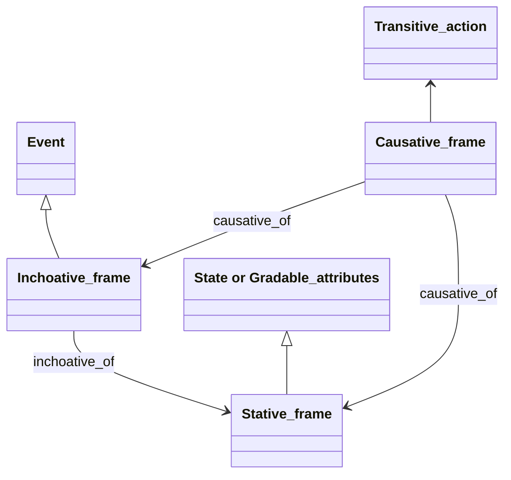
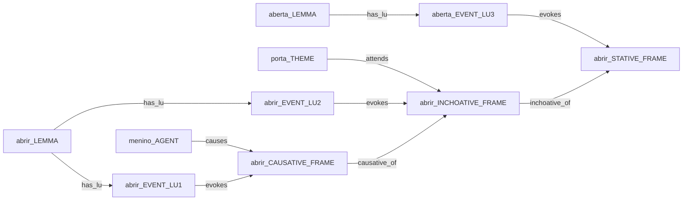
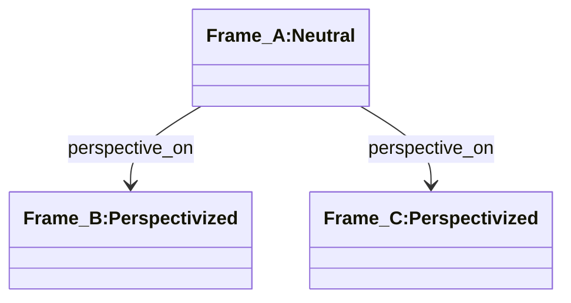
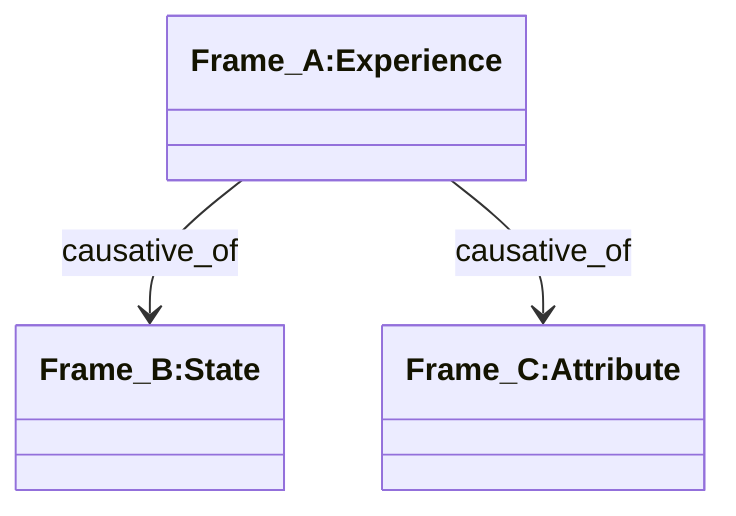
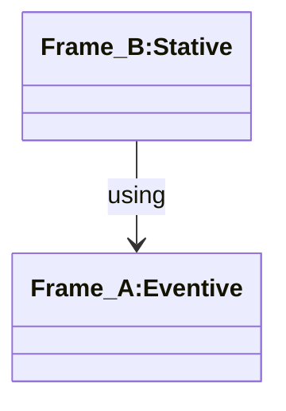
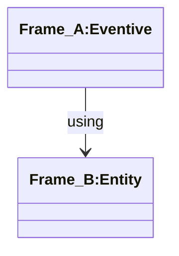

# Patterns

The idea of "design patterns" was introduced in the 1970s by mathematician and architect Christopher Alexander. In simplified terms, the use of "patterns" aims to share guidelines that help solve design problems. As he says, "each pattern describes a problem in our environment and the core of its solution, in such a way that you can use this solution more than a million times, without ever doing it the same way."

The use of patterns has been adapted to Software Engineering, Data Modeling, Requirements Analysis, Conceptual Modeling, and Ontological Engineering, among other areas. In this section, we provide a first outline of modeling patterns for a framenet, according to the FrameNet guidelines.

As a rule, patterns emerge from solutions adopted in previous projects that have proven to be functional. Since existing framenets are basically based on Berkeley's FN, we don't have "previous projects" that can serve as a basis. Thus, the patterns proposed in this section are merely abstractions of detectable structures in the current network, whose applicability in future modeling needs to be evaluated. Therefore, the set of patterns is entirely open to modifications and extensions.

### Change-of-state

- Name: Change-of-state (Causative-inchoative alternation)
- Intention: The FN regularly separates causative frames from inchoative frames (The book, 2.1.1), having even defined two specific relations for this case (**Causative_of** and **Inchoative_of**). 
According to *The book* (6.1.6), the systematic relations between stative frames and the causative and inchoative frames that refer to them are recorded. 
As seen before, causative frames should inherit from **Transitive_action**, inchoative frames should inherit from **Event**, and stative frames should inherit from **State** or **Gradable_attribute**. 
Most of these relations have not yet been implemented.

- Diagrams

- Example:
  - Stative: the door is open.
  - Inchoative: the door opened.
  - Causative: the boy opened the door.

Each use of the verb should be represented by different LU, which should be related to each other by lexical relations (causative_of/inchoative_of):

### Perspective
- Name: Perspective
- Intention: The implementation of this pattern (through the **Perspective_on** relation) indicates the presence of at least two different viewpoints, in relation to a neutral frame. 
Specifically, frames that have FEs related by **Excludes** have a separate viewpoint associated with each choice of an excluded FE.

- Conditions: the neutral frame is normally *Non-lexical* and *Non-perspectivized*.

- Diagram

### Experience
- Name: Experience
- Intention: Implementation of this pattern (through the **Causative_of** relation) indicates an experience that change conditions of a entity.

- Diagram

### EventState
- Name: EventState
- Intention: To explicitly separate LUs associated with events (in eventive frames) from LUs related to states that precede or follow these events (in stative frames). 
While the eventive frame focuses on the *occurrence of the event* and its participants, the stative frame focuses on the *condition of an entity* participating in the event.

- Diagram

### Agentive
- Name: Agentive_noun
- Intention: Remove the semantic type *Biframal_LU::Agentive_noun* by creating (or using) a frame related to the agentive name. 
The LU representing an "agent" must evoke a entity frame. 
The FE associated with the agent in the eventive frame must be associated with the entity frame via a FE-F relation if all LUs in the entity frame can be associated with the FE. 
Or through the LU-FE relation, in the case of a very generic entity frame, where only some LUs could be *filler* for the FE.

- Diagram

### Participant
- Name: Participating_entity
- Intention: Remove the semantic type *Biframal_LU::Participating_entity* by creating (or using) a frame related to the participant's name in the event.
  The LU representing an "participant" must evoke a entity frame.
  The FE associated with the participant in the eventive frame must be associated with the entity frame via a FE-F relation if all LUs in the entity frame can be associated with the FE.
  Or through the LU-FE relation, in the case of a very generic entity frame, where only some LUs could be *filler* for the FE.

- Diagram

